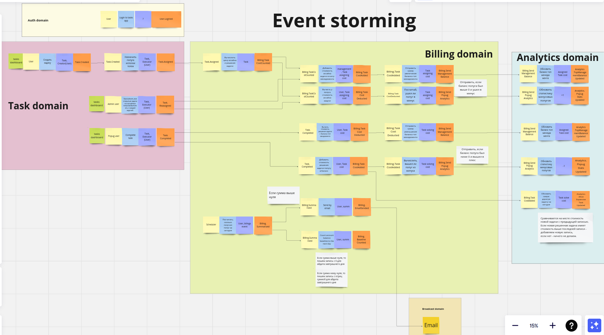
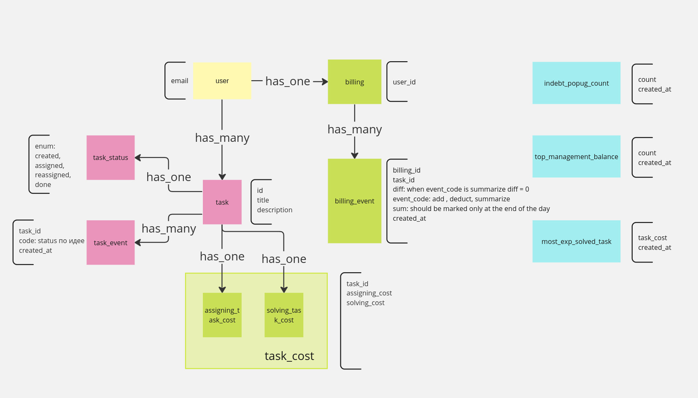
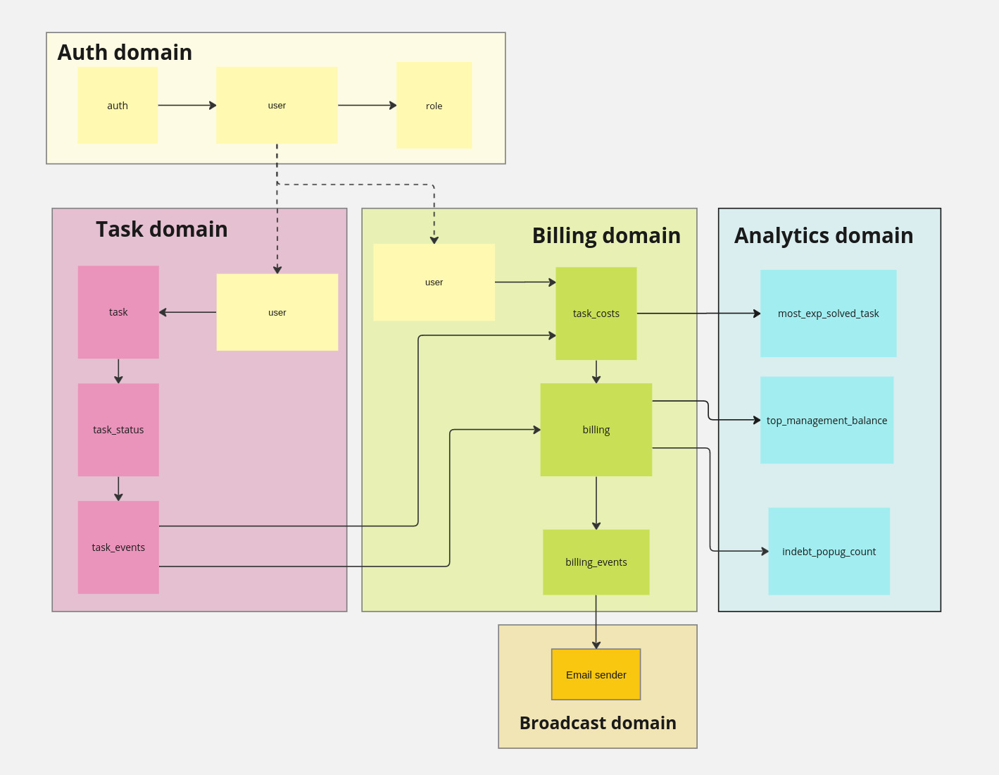
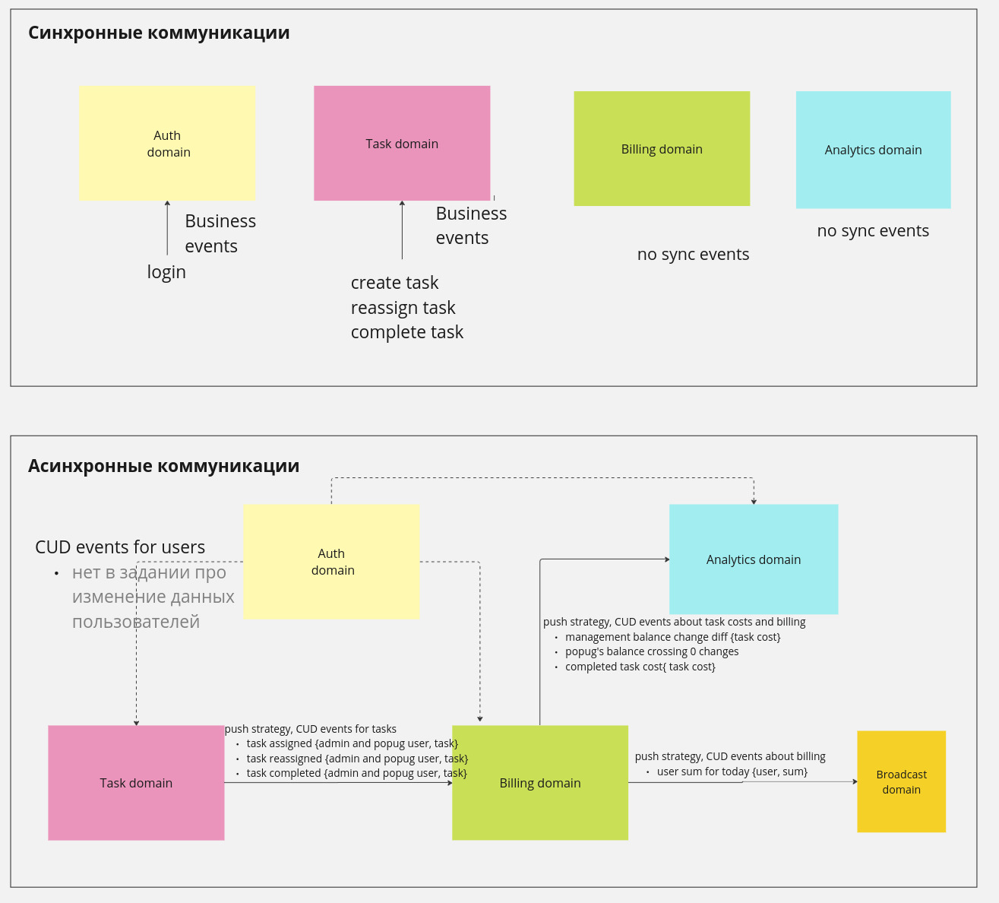

# Awesome Task Exchange System (aTES) для UberPopug Inc

Таск-трекер для хороших попугаев и их менеджеров.

[Projecting on Miro board](https://miro.com/app/board/uXjVNrRMs64=/?share_link_id=579065978405)

## 1 Event Storming



## 2 Model



## 3 Domain



Домены делают:

* Auth
  [x] login

* Task
    [x] создать задачу
    [x] назначить исполнителя задачи
    [x] переназначить исполнителя задачи
    [x] завершить задачу

* Billing
    [x] рассчитать две стоимости задачи
    [x] сохранение изменении балансов
    [x] отправка данных в аналитику об изменении баланса топ менеджмента, когда это происходит
    [x] приведение счетов аккаунтов в базовое состояние по расписанию
    [x] отправка данных в аналитику об пересечении балансе попуга значения 0, если таковое случается, при назначении ему или решении им задачи
    [x] отправка данных в аналитику о стоимости решенной задачи

* Analytics
    [x] сохранить пришедшие данные о заработках менеджмента
    [x] сохранить пришедшие данные об изменении количества попугов с отриц балансом
    [x] сохранить пришедшие данные о стоимости задачи, если оно превышает значение предыдущее максимальное значение
* Broadcast
    [x] рассчитать попуга

## 3 Communication



----------

```shell
Поддержка: Айнур Шауэрман, i@aykuli.ru
```
