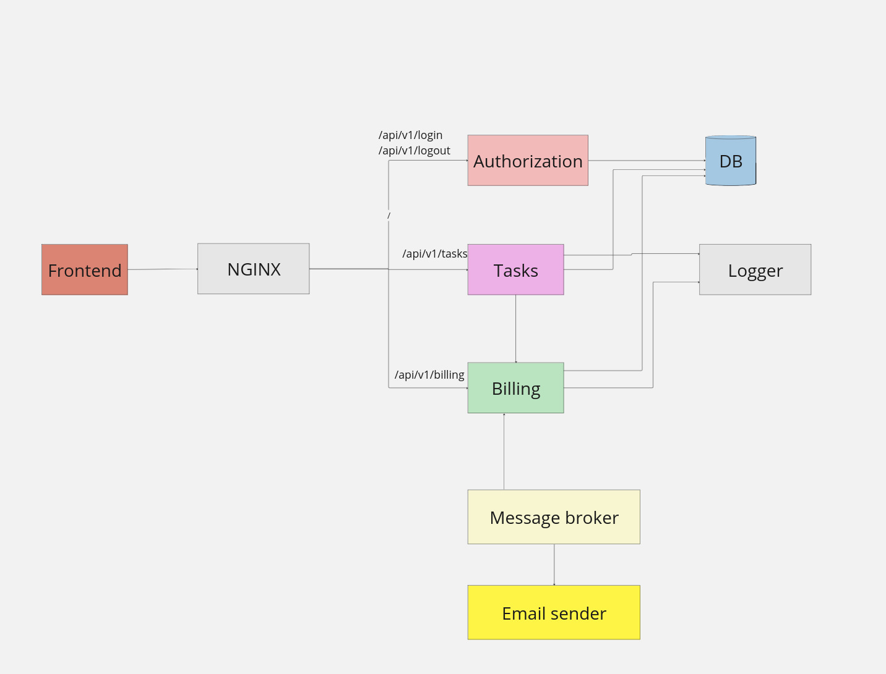

# Awesome Task Exchange System (aTES) для UberPopug Inc

Студент - Айнур Шауэрман.

## Неделя 0

Сервисы:

* Frontend (красный). Асинхронно общается с nginx

* Nginx (серый). Разрешает, с каким сервисом фронт хочет общаться.

* Авторизация (персиковый). Создает сессионный токен в БД.

* Сервис заданий (розовый). Общается с биллингом синхронно, с логгером асинхронно. Обновляет данные о заданиях и синхронно общается с БД, синхронно синхронизирует задачи с биллингом, если нужно, асинхронно записывает все действия в логгер.

* Сервис биллинга (салатовый). Обновляет и отдает информацию о состоянии счетов. Общается синхронно с БД и сервисом задач. асинхронно общается с брокером.

* База данных (голубая). Хранит данные.
Общается с сервисами авторизации, заданий и билингом синхронно.

* Логгер. Общается асинхронно с сервисами задач и биллинга.

* Брокер сообщений (блекло-желтый). Асинхронно общается с биллингом и рассылкой. Вызывает сервис биллинга по расписанию или по запросу.

* Рассылка (желтая). Отправляет почту о балансе счета на конец дня. Общается с сервисом брокеров сообщений асинхронно, так как не важно в какой очередности попуги получать данные о своих счетах.
